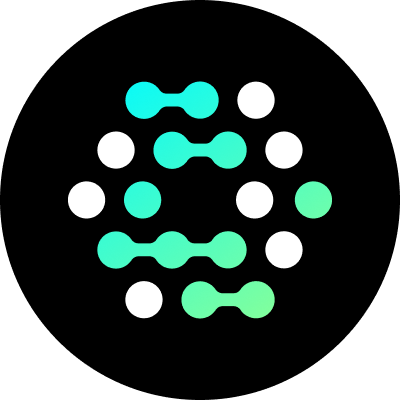

<div align="center">
  <p><a href="https://openfga.dev"></a></p>

  <h1>fga-mcp</h1>

  <p>MCP server for <a href="https://openfga.dev/">OpenFGA</a> and <a href="https://auth0.com/fine-grained-authorization">Auth0 FGA</a></p>
</div>

<p><br /></p>

Gives agents tools, resources, prompts, and bundled documentation for working with fine-grained authorization — with or without a live OpenFGA server.

## Use cases

- **Plan & design** — Design authorization models using best-practice patterns, prompts, and local DSL validation
- **Generate code** — Produce accurate SDK integrations leveraging bundled documentation search and code examples
- **Manage instances** — Query and control live OpenFGA servers (stores, models, tuples) via [live servers](#live-servers)

## Contents

- [About](#about)
- [Core features](#core-features)
- [Live servers](#live-servers)
- [Getting started](#getting-started)
- [FGA config file](#fga-config-file)
- [How agents route requests](#how-agents-route-requests)
- [How runtime authentication works](#how-runtime-authentication-works)
- [Tool and resource catalog](#tool-and-resource-catalog)
- [Configuration reference](#configuration-reference)
- [Development](#development)
- [License](#license)

## About

Derived from the PHP-based [openfga-mcp](https://github.com/evansims/openfga-mcp) by [Evan Sims](https://github.com/evansims) ([Apache-2.0](https://www.apache.org/licenses/LICENSE-2.0)). This TypeScript port has the same configuration, tools, resources, prompts, and documentation features. The model authoring guide ([`docs/AUTHORING_OPENFGA_MODELS.md`](docs/AUTHORING_OPENFGA_MODELS.md)) is adapted from [openfga-modeling-mcp](https://github.com/aaguiarz/openfga-modeling-mcp) by [Andrés Aguiar](https://github.com/aaguiarz) ([MIT](https://opensource.org/licenses/MIT)).

This MCP server extends the original with multiple fixed servers, dynamic connections, and agent-isolated (out-of-band) authentication — see [Live servers](#live-servers).

Built with [FastMCP](https://github.com/punkpeye/fastmcp), [@modelcontextprotocol/sdk](https://www.npmjs.com/package/@modelcontextprotocol/sdk), [@openfga/sdk](https://www.npmjs.com/package/@openfga/sdk), and [@openfga/syntax-transformer](https://www.npmjs.com/package/@openfga/syntax-transformer). Requires Node.js **20+**.

## Core features

Bundled documentation, prompts, and local tools for authorization modeling — no live OpenFGA connection required:

- OpenFGA SDK documentation, search, and code examples
- Model design and troubleshooting **prompts**
- **`verify_model`** — validate authorization model DSL locally

## Live servers

Configure an MCP server instance to talk to real OpenFGA backends. Fixed and dynamic connectivity are separate options — use either, both, or neither. When FGA requires credentials not in config, see [How runtime authentication works](#how-runtime-authentication-works).

### Fixed servers

Define one or more named servers (`dev`, `prod`, …) in the FGA config file (`--config`). fga-mcp loads those profiles at startup.

When a server has an **`auth` block** (or FGA allows unauthenticated access), agents call admin tools with an optional `server` name (or `default_server`) and optional `store` / `model` — no connection management. Credentials and policy live in the config file.

When a fixed server is listed **without** `auth` but FGA requires authentication, the agent will drive [runtime authentication](#how-runtime-authentication-works) via `connect_server({ server })` when `list_servers` shows `auth_status: connect_required`.

### Dynamic connections

Set **`allow_dynamic_connections: true`** so agents can call **`connect_server({ api_url })`** to attach backends not listed in config.

Each connect (fixed auth-required or dynamic) mints or extends a **`connection_scope`** (UUID). Scoped tool calls pass that scope plus `server`. **`connect_server({ server })`** for fixed auth-required servers does not require `allow_dynamic_connections`.

| | Fixed servers | Dynamic connections |
|---|---------------|---------------------|
| **Enable** | `servers.*` in FGA config | `allow_dynamic_connections: true` |
| **Typical use** | Known dev/prod backends | Ad-hoc or agent-discovered URLs |
| **Routing** | `server` param (and `connection_scope` when scoped) | `connect_server({ api_url })` → `connection_scope` + `server` |

Call **`list_servers`** to discover fixed servers (`auth_status: connect_required` when connect is needed), whether dynamic connect is enabled (`dynamic_connections_enabled`), and — with `connection_scope` — scoped entries with **`connected`**.

See [Dynamic connection settings](#dynamic-connection-settings) for scope limits, workflow, and transport rules.

## Getting started

Works with [Cursor](https://cursor.sh), [Claude Desktop](https://claude.ai/download), [Claude Code](https://www.anthropic.com/claude-code), and other MCP clients.

Configuration is passed as **CLI args** (preferred). The same args work for stdio subprocess launch and for running a standalone HTTP server. Environment variables are a fallback when a client cannot pass args — see [Configuration reference](#configuration-reference).

### 1. Core features

Documentation, prompts, and `verify_model` — no `--config` required:

```json
{
  "mcpServers": {
    "OpenFGA": {
      "command": "npx",
      "args": ["fga-mcp"]
    }
  }
}
```

### 2. Live servers (stdio)

Add `--config` for store, model, and tuple tools (core features remain available):

```json
{
  "mcpServers": {
    "OpenFGA": {
      "command": "npx",
      "args": ["fga-mcp", "--config", "/absolute/path/to/fga-mcp.json"]
    }
  }
}
```

> **Safety:** Write operations are disabled by default (`writeable: false`). Set `writeable: true` on a server profile or in `defaults` to allow mutations.

Minimal `fga-mcp.json` — see [FGA config file](#fga-config-file) for multi-server, auth, and policy examples.

### 3. HTTP transport

Run fga-mcp as a standalone HTTP MCP server (with or without `--config`):

```bash
npx fga-mcp --config ./fga-mcp.json --transport http --host 127.0.0.1 --port 9090
```

MCP endpoint: `http://127.0.0.1:9090/mcp` (streamable HTTP). By default responses stream over this endpoint; use `--no-sse` for JSON-only responses if your client requires it.

**Client config** (Cursor, Claude Desktop, or other streamable-HTTP MCP clients):

```json
{
  "mcpServers": {
    "OpenFGA": {
      "url": "http://127.0.0.1:9090/mcp"
    }
  }
}
```

HTTP suits Docker, shared hosts, and reverse-proxy deployments. Put edge authentication and rate limiting in front of fga-mcp; it does not replace that layer. [Runtime authentication](#how-runtime-authentication-works) requires HTTP transport when credentials are not in config.

## FGA config file

The FGA config JSON is the primary way to define OpenFGA servers, defaults, and policy. Pass it with `--config <path>` or, when CLI args are unavailable, via `OPENFGA_MCP_CONFIG` (file path or inline JSON for containers).

| Field | Default | Purpose |
|-------|---------|---------|
| `default_server` | First server / `default` | Default `server` when omitted on tool calls |
| `allow_dynamic_connections` | **`false`** | Enable dynamic connections — `connect_server({ api_url })`; opt-in only |
| `defaults.*` | `writeable: false`, `restrict: false` | Global policy and store/model defaults |
| `servers.*` | — | Fixed OpenFGA servers loaded at startup |
| `dynamic.*` | See [Dynamic connection settings](#dynamic-connection-settings) | Scope TTL and caps |

**Example** — multi-server with policy and auth:

```json
{
  "default_server": "dev",
  "defaults": { "writeable": false },
  "servers": {
    "dev": {
      "api_url": "http://127.0.0.1:8080",
      "default_store": "01HXYZ...",
      "writeable": true
    },
    "prod": {
      "api_url": "https://api.us1.fga.dev",
      "auth": {
        "method": "api_token",
        "token": "YOUR_TOKEN"
      },
      "default_store": "01HABC...",
      "default_model": "01HMODEL...",
      "restrict": true,
      "writeable": false
    }
  }
}
```

Per-server `default_store` and `default_model` belong on each entry in multi-server setups. Top-level `defaults.default_store` / `default_model` apply to legacy single-server env bootstrap only.

When no `--config` is passed, legacy `OPENFGA_MCP_API_*` environment variables bootstrap a single fixed server named `default` (or `OPENFGA_MCP_DEFAULT_SERVER`). Prefer the config file for new setups — see [Migrating from legacy env](#migrating-from-legacy-env).

### Policy: restrict vs writeable

`restrict` and `writeable` are **independent** per server (or global defaults):

- **`restrict: true`** — operations must use the pinned `default_store` / `default_model` when provided.
- **`writeable: true`** — allows mutations (create/delete stores, models, tuples).

A read-only prod server uses `restrict: true` with `writeable: false`. Legacy env setups that relied on `OPENFGA_MCP_API_RESTRICT=true` blocking writes should set **both** in FGA config — `restrict` alone no longer disables writes.

### Dynamic connection settings

Runtime connect is **disabled by default**. Enable in FGA config:

```json
{
  "allow_dynamic_connections": true,
  "dynamic": {
    "scope_idle_ttl_seconds": 86400,
    "max_servers_per_scope": 10,
    "max_scopes": 100
  },
  "servers": {
    "dev": { "api_url": "http://127.0.0.1:8080" }
  }
}
```

Omit `dynamic` for defaults (`scope_idle_ttl_seconds`: 86400, `max_servers_per_scope`: 10, `max_scopes`: 100 on HTTP). Set any limit to **`null`** to disable that cap or idle eviction.

**Workflow:**

1. Call `connect_server({ api_url })`. If FGA requires auth, the agent completes [runtime authentication](#how-runtime-authentication-works) and retries. Response includes `connection_scope` and the **assigned** `server` name.
2. Pass both on subsequent admin and relationship tool calls.
3. Call `disconnect_server` when done. Removing the last server in a scope drops the scope.

**Transport rules:**

| | Stdio | HTTP |
|---|-------|------|
| `connection_scope` on dynamic calls | Optional when exactly one dynamic scope exists | Required |
| Max dynamic scopes | 1 | `dynamic.max_scopes` (default 100) |
| Idle scope cleanup | Process exit | `dynamic.scope_idle_ttl_seconds` (default 24h) |

Scope IDs are unguessable UUIDs minted by the server. Tokens and secrets are never logged.

## How agents route requests

Reference for how live-server tool calls work internally. **You do not pass routing parameters** — agents discover servers via `list_servers`, call `connect_server` when needed, and supply routing on subsequent tool calls automatically.

| Parameter | Applies to | Description |
|-----------|------------|-------------|
| `connection_scope` | Admin tools, relationship tools (scoped connections) | Scope UUID from `connect_server`; omitted for unscoped fixed servers |
| `server` | Admin tools, relationship tools | Named OpenFGA server (fixed config or assigned dynamic name) |
| `store` | Relationship tools | Store ID; falls back to server `default_store` |
| `model` | Relationship tools | Model ID; falls back to server `default_model` or `"latest"` |

Agents call **`list_servers`** to see fixed servers and whether dynamic connect is enabled; with a `connection_scope`, to list scoped entries. They may call **`set_default_server`** to change the default within the fixed pool or a scoped connection.

Resource URIs follow the same rules: server-prefixed when multiple fixed servers exist (`openfga://server/{server}/store/...`); scope-prefixed for dynamic connections (`openfga://scope/{connectionScope}/server/{server}/store/...`).

On HTTP, scoped connections require `connection_scope` on FGA tool calls (stdio may omit it when exactly one scope exists). This is enforced by the server; agents learn scope IDs from `connect_server` responses.

## How runtime authentication works

Reference for out-of-band credential collection. **Nothing to configure per session** beyond your FGA config and transport choice (below). When auth is needed, the agent receives an auth URL from a tool error, **you complete the browser form once**, and the agent retries the same tool call.

**What you configure (once):**

- Put credentials in the FGA config **`auth` block**, **or**
- Run with **`--transport http`** so fga-mcp can host the auth form (stdio requires config `auth` or an open FGA server)
- Optionally set `--public-url` / `OPENFGA_MCP_PUBLIC_URL` when the auth page is not at `http://127.0.0.1:<port>`

Credentials are **never** passed in tool arguments or exposed to the agent or model — fga-mcp stores them server-side only.

**What the agent does automatically:**

| Scenario | When elicitation fires |
|----------|------------------------|
| Fixed server in config, no `auth`, FGA requires auth | `connect_server({ server })` when `list_servers` shows `auth_status: connect_required` |
| Dynamic connection | `connect_server({ api_url })` when the target FGA requires auth |
| Scoped connection, credentials expired | An FGA tool returns 401; agent re-elicits; retry after you complete the form |

**What you do when prompted:** open the auth URL (often opened by the MCP client), submit credentials in the browser, then let the agent retry. Hosted forms are at `/auth/elicit/:id` on the same origin as `/mcp` (pre-shared key or OIDC client credentials).

<details>
<summary>Integrator details (response shape, patch)</summary>

MCP clients that declare URL elicitation receive error code `-32042` with the auth URL; others receive a structured tool error with the same URL. Wire-format details: [`specs/openfga-auth-elicitation.md`](specs/openfga-auth-elicitation.md).

URL elicitation requires a `patch-package` fix to FastMCP 4.3.0 (applied on `npm install`) until [upstream #162](https://github.com/punkpeye/fastmcp/issues/162) lands.

</details>

## Tool and resource catalog

### Tools (21)

- **Stores:** `create_store`, `delete_store`, `get_store`, `list_stores`
- **Models:** `create_model`, `get_model`, `get_model_dsl`, `list_models`, `verify_model`
- **Permissions:** `check_permission`, `grant_permission`, `revoke_permission`, `list_objects`, `list_users`
- **Servers:** `list_servers`, `set_default_server`, `connect_server`, `disconnect_server`
- **Documentation:** `find_similar_documentation`, `search_code_examples`, `search_documentation`

### Resources

Admin resource templates are registered **at startup based on FGA config**. Documentation resources (`openfga://docs/...`) are part of [core features](#core-features) and do not require live servers.

| Deployment | Admin URI pattern | Example |
|------------|-------------------|---------|
| Core features only (no FGA config) | None — docs only | `openfga://docs` |
| Single fixed server | **Legacy** — server implicit | `openfga://store/{storeId}/model/{modelId}` |
| Multiple fixed servers | **Server-prefixed** | `openfga://server/{server}/store/{storeId}/...` |
| Dynamic connections enabled | **Scope-prefixed** for scoped reads | `openfga://scope/{connectionScope}/server/{server}/store/{storeId}/...` |

When both fixed servers and dynamic connections are enabled, both template families are registered. Scoped resource names use a `_scoped` suffix when they coexist with fixed-server templates.

Seven documentation endpoints are always registered. With a single fixed server, add one static `list_stores` resource and nine admin templates (17 total endpoints).

### Prompts (17)

Model design, authoring guidance, security guidance, and relationship troubleshooting prompts.

### Completions

When connected to a live OpenFGA server, argument completion is provided for store IDs, model IDs, relations, users, objects, and documentation identifiers.

## Configuration reference

CLI flags take precedence over environment variables, then defaults. FGA connection settings (`servers`, `defaults`, `allow_dynamic_connections`, …) belong in the **config file**, not on the CLI.

### CLI flags

| Flag | Env fallback | Default |
|------|--------------|---------|
| `--config <path>` | `OPENFGA_MCP_CONFIG` (file path or inline JSON) | — |
| `--transport stdio\|http` | `OPENFGA_MCP_TRANSPORT` | `stdio` |
| `--host <addr>` | `OPENFGA_MCP_TRANSPORT_HOST` | `127.0.0.1` |
| `--port <n>` | `OPENFGA_MCP_TRANSPORT_PORT` | `9090` |
| `--sse` / `--no-sse` | `OPENFGA_MCP_TRANSPORT_SSE` | `true` (streaming on `/mcp`; `--no-sse` for JSON responses) |
| `--stateless` / `--no-stateless` | `OPENFGA_MCP_TRANSPORT_STATELESS` | `false` |
| `--public-url <origin>` | `OPENFGA_MCP_PUBLIC_URL` | — |
| `--debug` / `--no-debug` | `OPENFGA_MCP_DEBUG` | `true` |

`--public-url` is the browser-reachable origin for [runtime authentication](#how-runtime-authentication-works) links (e.g. `https://fga-mcp.example.com`). Omit for local dev — defaults to `http://127.0.0.1:<port>`. Distinct from `--host` (bind address only).

### Environment variables

Use when an MCP client cannot pass CLI args, or for legacy single-server bootstrap without a config file.

**Transport and runtime:**

| Variable | Default | Description |
|----------|---------|-------------|
| `OPENFGA_MCP_TRANSPORT` | `stdio` | `stdio` or `http` |
| `OPENFGA_MCP_TRANSPORT_HOST` | `127.0.0.1` | HTTP bind address |
| `OPENFGA_MCP_TRANSPORT_PORT` | `9090` | HTTP port |
| `OPENFGA_MCP_TRANSPORT_SSE` | `true` | Streamable HTTP on `/mcp` when `true`; JSON responses when `false` |
| `OPENFGA_MCP_TRANSPORT_STATELESS` | `false` | Stateless HTTP sessions |
| `OPENFGA_MCP_PUBLIC_URL` | | Public origin for auth elicitation URLs |
| `OPENFGA_MCP_DEBUG` | `true` | Write debug logs to `logs/mcp-debug.log` |
| `OPENFGA_MCP_CONFIG` | | FGA config file path or inline JSON |

**Legacy single-server bootstrap** — when no config file is loaded, these create one fixed server named `default` (or `OPENFGA_MCP_DEFAULT_SERVER`):

| Variable | Default | Description |
|----------|---------|-------------|
| `OPENFGA_MCP_DEFAULT_SERVER` | `default` | Name for the bootstrap server |
| `OPENFGA_MCP_API_URL` | | OpenFGA server URL |
| `OPENFGA_MCP_API_WRITEABLE` | `false` | Enable writes (prefer FGA config `writeable`) |
| `OPENFGA_MCP_API_STORE` | | Default/restrict store ID |
| `OPENFGA_MCP_API_MODEL` | | Default/restrict model ID |
| `OPENFGA_MCP_API_RESTRICT` | `false` | Lock to configured store/model |
| `OPENFGA_MCP_API_TOKEN` | | Pre-shared API token → `auth: { method: "api_token", token: "..." }` |
| `OPENFGA_MCP_API_CLIENT_ID` | | OAuth client ID → `auth.method: "client_credentials"` |
| `OPENFGA_MCP_API_CLIENT_SECRET` | | OAuth client secret |
| `OPENFGA_MCP_API_ISSUER` | | OAuth token issuer |
| `OPENFGA_MCP_API_AUDIENCE` | | OAuth audience (optional) |

| Env var | FGA config equivalent |
|---------|----------------------|
| `OPENFGA_MCP_API_URL` (+ auth) | single `servers.default` |
| `OPENFGA_MCP_API_WRITEABLE` | `defaults.writeable` |
| `OPENFGA_MCP_API_RESTRICT` | `defaults.restrict` |
| `OPENFGA_MCP_API_STORE` | `defaults.default_store` |
| `OPENFGA_MCP_API_MODEL` | `defaults.default_model` |

### Migrating from legacy env

1. Replace flat `OPENFGA_MCP_API_*` vars with an FGA config file (`--config`) when you need multiple servers or per-server policy.
2. Map `OPENFGA_MCP_API_RESTRICT=true` to `restrict: true` **and** `writeable: false` for read-only prod.
3. Map `OPENFGA_MCP_API_WRITEABLE=true` to `writeable: true` on the server profile or in `defaults`.
4. The bootstrap server is named `default` unless `OPENFGA_MCP_DEFAULT_SERVER` is set.
5. Call `list_servers` to discover fixed servers and whether `connect_server` is available.

## Development

### From source

```bash
git clone https://github.com/BobDickinson/fga-mcp.git
cd fga-mcp
npm install
npm run build
node dist/index.js --config ./fga-mcp.json
```

For hot reload, use `tsx` on `src/index.ts` in the MCP client `command` / `args` instead of `npx fga-mcp`.

### Docker

```bash
docker build -t fga-mcp .
docker run --rm -p 9090:9090 fga-mcp \
  --config /path/in/container/fga-mcp.json \
  --transport http --host 0.0.0.0 --port 9090
```

Mount your FGA config into the container. Port `9090` is exposed for HTTP transport.

### Project structure

```
src/
  index.ts                  # Entry point
  cli.ts                    # CLI arg parser
  runtime-config.ts         # Transport/runtime config (CLI + env)
  fga-config.ts             # FGA JSON config loader
  server-pool.ts            # Fixed multi-server pool + policy resolution
  dynamic-scope-store.ts    # Runtime connect scopes
  connection-resolver.ts    # Unified client resolution
  admin-context.ts          # Server/store/model resolution for handlers
  resource-resolver.ts      # Resource URI normalization + resolution
  server.ts                 # Server bootstrap, transport, lifecycle
  config.ts                 # Environment configuration
  guards.ts                 # Write/restrict guards
  connect-flow.ts           # connect_server probe + elicitation orchestration
  auth-probe.ts             # Unauthenticated FGA probe + credential validation
  openfga-auth-error.ts     # 401 classifier for re-elicit vs refresh
  fga-call.ts               # Scoped FGA error → reauth elicitation
  elicitation/              # Session registry, pending store, elicitation request helper
  auth/                     # Hosted Pre-shared / OIDC auth form routes (HTTP)
  client.ts                 # Server context + OpenFGA client access
  dsl.ts                    # DSL parse/validate via syntax-transformer
  documentation/            # Bundled docs index, search, and chunker
  tools/                    # MCP tools
  resources/                # MCP resources (admin.ts, documentation)
  prompts/                  # MCP prompts
  completions/              # Argument completion helpers
docs/                       # Synced SDK documentation
```

### Scripts

| Command | Description |
|---------|-------------|
| `npm run build` | Compile TypeScript to `dist/` |
| `npm start` | Run compiled server (`node dist/index.js`) |
| `npm run dev` | Run with `tsx` (no build step) |
| `npm run typecheck` | Type-check without emitting |
| `npm test` | Run unit tests |
| `npm run test:unit` | Run unit tests with coverage |
| `npm run test:integration` | Run integration tests (requires OpenFGA at `OPENFGA_MCP_API_URL`) |
| `npm run test:integration:docker` | Run integration tests in Docker (recommended) |
| `npm run docs:sync` | Sync bundled documentation from upstream repos |
| `npm publish` | Publish to npm (runs unit tests, then build via lifecycle hooks) |

## License

MIT
